大家好久不见！本次更新主要涉及3个方面：ringing/overshooting问题、纹理涂抹优化和噪声放大修复。

由于优化效果都比较细节，普通玩家不会有很多感知，所以起名Pro，专业玩家更在意这些。

1、 ringing/overshooting问题优化

我们在训练时，对ground truth样本进行了锐化（参考RealESRGAN中的USM锐化）。这次我们更换了锐化算法，削弱了锐化造成的ringing/overshooting。

对比case：公主连结动画第二季OP1分13.5秒，步未脸部、头发边缘的亮光（2倍超分，下同）

|               | 最大降噪强度                                                 | 不降噪                                                       |
| ------------- | ------------------------------------------------------------ | ------------------------------------------------------------ |
| RealCUGAN     | 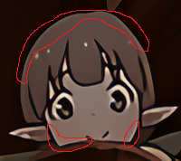 | 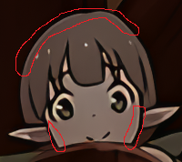 |
| RealCUGAN-Pro |  |  |

如果认为锐化过度，可以调高Alpha值降低锐化强度

| 原图                                                         | 优化前：RealCUGAN-最大降噪强度                               | 优化后：RealCUGAN-Pro-最大降噪强度-Alpha1.4                  |
| ------------------------------------------------------------ | ------------------------------------------------------------ | ------------------------------------------------------------ |
|  |  | 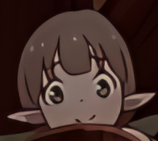 |

2、纹理涂抹优化

在生成对抗训练阶段，RealCUGAN-Pro利用自带的前景、背景蒙版，屏蔽背景（例如纹理、虚化较多的区域）区域的生成对抗监督，使得降噪版的背景区域具备了原保守版的优势，同时降噪版的线条部分比保守版更锐利。

| 原图                                                       | sobel梯度                                                    |
| ---------------------------------------------------------- | ------------------------------------------------------------ |
| 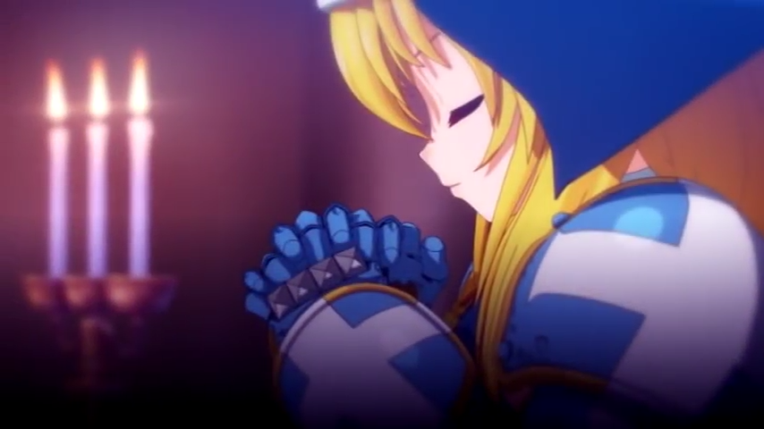    | 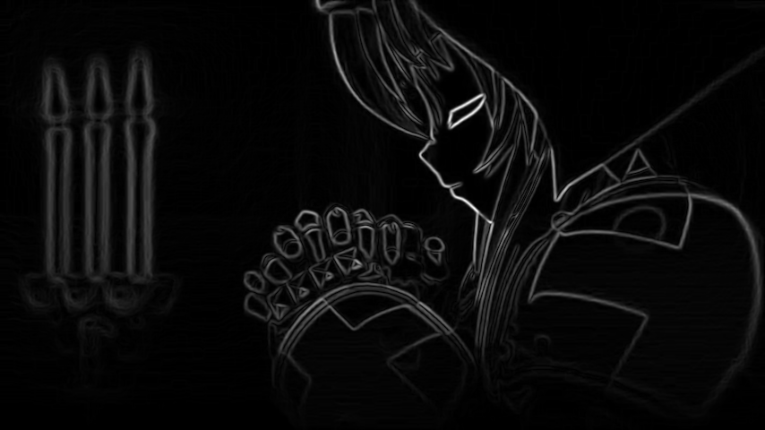    |
| **sobel梯度+二值化+膨胀+均值滤波得到的线条蒙版**           | **RealCUGAN生成的蒙版**                                      |
| 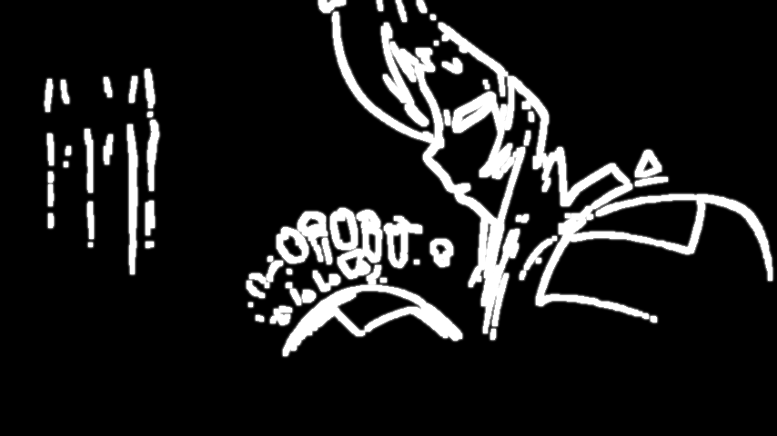 | 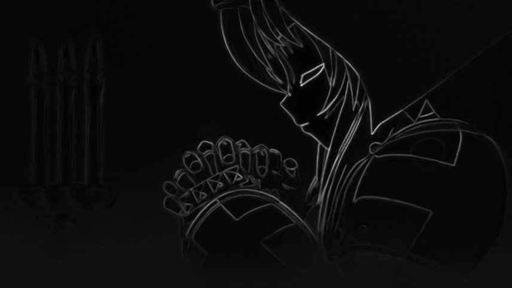 |

可以看出，RealCUGAN生成的蒙版，对比sobel梯度，增强了线条部分的强度，抑制了背景区域（蜡烛边缘）的强度。

对比case：《Love Live! Superstar》ED 29秒

| 原图                                                         | RealESRGAN-Anime6B                                           | RealESRGAN-SRVGG_v3                                          |
| ------------------------------------------------------------ | ------------------------------------------------------------ | ------------------------------------------------------------ |
|  |  |  |
| **RealCUGAN最大强度降噪**                                    | **RealCUGAN-Pro最大强度降噪**                                | **RealCUGAN-Pro最大强度降噪-Alpha1.5**                       |
|  |  | 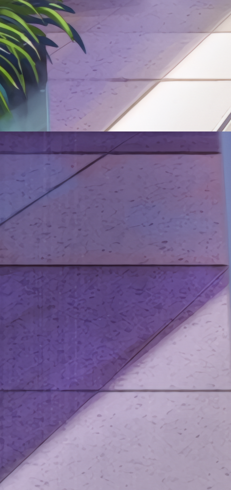 |

地板的粗糙纹理是人为加上去，需要保留的。Pro对比旧版，最大降噪等级依然对纹理进行了完整的保留，并且将alpha调整至1.5可以抑制高频纹理的增强。初版RealESRGAN动漫模型将纹理全部涂抹，最新版（SRVGG_v3）动漫模型在纹理保留上有了质的飞跃，但从上面4行砖可以明显看出，这个case的纹理保留程度依然没有RealCUGAN-Pro更高。

进一步用同样（降噪等级）的模型对RealESRGAN自带的测试样例黑猫进行对比，可以发现RealCUGAN-Pro能有效去除Artifact，说明它可以区分纹理和异常噪声。

| 原图                                                         | RealCUGAN-Pro最大强度降噪                                    | RealESRGAN-Anime6B                                           | RealESRGAN-SRVGG_v3                                          |
| ------------------------------------------------------------ | ------------------------------------------------------------ | ------------------------------------------------------------ | ------------------------------------------------------------ |
|  | 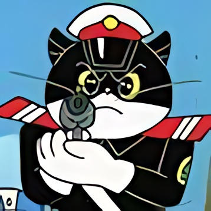 |  |  |

3、降噪优化

对比case：《凉宫春日的忧郁2009》ED 43秒

保守版、非降噪版本不进行任何降噪处理，改为对不合理噪声进行最低幅度的抑制，具体表现为，对可能被增强的artifact进行削除，同时不降低纹理保留度。注意到，原片的噪点（朝比奈实玖瑠的头发）经过压缩block的artifact已经变成非正常噪声，不应该保留，否则会被超分模型异常放大。如果专业压制者们实在注重噪声保留度（或者原片部分片段为艺术表现有强烈加躁），可以对原片噪声进行分析or提取，在超分后进行加躁处理。

另外注意到，除了抑制不合理噪声外，Pro版的线条的去模糊处理更彻底。（下载图片 + 键盘←→切换，可轻松看出）

| 原图                    | 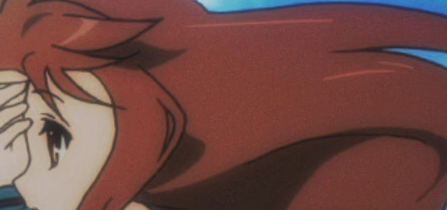 |
| ----------------------- | ------------------------------------------------------------ |
| **RealCUGAN保守版**     | 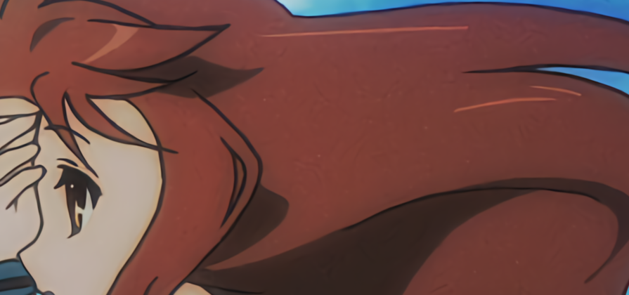 |
| **RealCUGAN-Pro保守版** |  |

使用方法：网盘老地址下载模型参数（[百度网盘(提取码ds2a) :link:](https://pan.baidu.com/s/10NbgnusDucllKiE0sgBWvQ)｜[GithubRelease :link:](https://github.com/bilibili/ailab/releases/tag/Real-CUGAN)｜ [GoogleDrive :link:](https://drive.google.com/drive/folders/1UFgpV14uEAcgYvVw0fJuajzy1k7JIz6H)），需要在config.py里面指定，同时下载新的upcunet_v3.py进行覆盖。(由于作者对4x新版模型效果不是很满意，暂时只放出2倍和3倍，每个倍率3个模型，conservative/no-denoise/denoise3x）

北京时间2022年5月35日 0时50分

