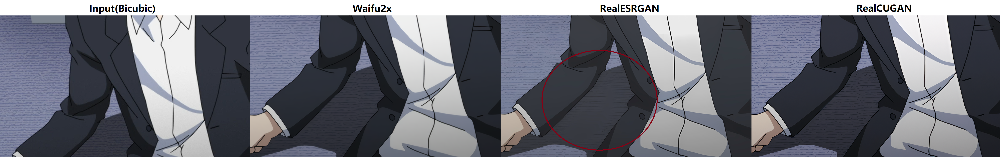

Real Cascade U-Nets for Anime Image Super Resolution
-------------------------------------------

[中文](README.md) **|** [English](README_EN.md)

:fire: **Real-CUGAN**:fire: 是一个使用百万级动漫数据进行训练的，结构与Waifu2x兼容的通用动漫图像超分辨率模型。它支持**2x\3x\4x**倍超分辨率，其中2倍模型支持4种降噪强度与保守修复，3倍/4倍模型支持2种降噪强度与保守修复。

**Real-CUGAN** 为windows用户打包了一个可执行环境，未来将支持GUI。

### 1. 效果对比

https://user-images.githubusercontent.com/61866546/147812864-52fdde74-602f-4f64-ac05-4d34cc58aa79.mp4

- **效果图对比**(推荐点开大图在原图分辨率下对比)
   
  纹理挑战型(注意地板纹理涂抹)(图源:《侦探已死》第一集10分20秒)
  
  线条挑战型(注意线条中心与边缘的虚实)(《东之伊甸》第四集7分30秒)
  
  极致渣清型(注意画风保留、杂线、线条)(图源:Real-ESRGAN官方测试样例)
  
  景深虚化型(蜡烛为后景，刻意加入了虚化特效，应该尽量保留原始版本不经过处理)(图源:《～闘志の華～戦国乙女2ボナ楽曲PV》第16秒)
  
- **详细对比**

|                | Waifu2x(CUNet)                                               | Real-ESRGAN(Anime6B)                                         | Real-CUGAN                                              |
| -------------- | ------------------------------------------------------------ | ------------------------------------------------------------ | ------------------------------------------------------------ |
| 训练集         | 私有二次元训练集，量级与质量未知                             | 私有二次元训练集，量级与质量未知                             | 百万级高清二次元patch dataset                                |
| 推理耗时(1080P)    | Baseline                                                     | 2.2x                                                         | 1x                                                           |
| 效果(见对比图) | 无法去模糊，artifact去除不干净                               | 锐化强度最大，容易改变画风，线条可能错判， 虚化区域可能强行清晰化 | 更锐利的线条，更好的纹理保留，虚化区域保留                   |
| 兼容性         | 大量windows-APP使用，VapourSynth支持， Caffe支持，PyTorch支持，NCNN支持 | PyTorch支持，VapourSynth支持，NCNN支持                       | 同Waifu2x，结构相同，参数不同，与Waifu2x无缝兼容             |
| 强度调整       | 仅支持多种降噪强度                                           | 不支持                                                       | 已完成4种降噪程度版本和保守版，未来将支持调节不同去模糊、 去JPEG伪影、锐化、降噪强度 |
| 尺度           | 仅支持1倍和2倍                                               | 仅支持4倍                                                    | 已支持2倍、3倍、4倍，1倍训练中              |

### 2. Windows玩家
修改config.py配置参数，双击go.bat运行
- #### 超分工具：
    [百度网盘(提取码ds2a) :link:](https://pan.baidu.com/s/10NbgnusDucllKiE0sgBWvQ)｜[GithubRelease :link:](https://github.com/bilibili/ailab/releases/tag/Real-CUGAN) | [和彩云(提取码tX4O,手机号验证码登录,不限速无需客户端) :link:](https://caiyun.139.com/m/i?015CHcCjUh9SL)｜ [GoogleDrive :link:](https://drive.google.com/drive/folders/1UFgpV14uEAcgYvVw0fJuajzy1k7JIz6H)
- #### 系统环境：
    - :heavy_check_mark: 在win10-64bit系统下进行测试
    - :heavy_check_mark: 小包需求系统cuda >= 10.0. 【大包需求系统cuda >= 11.1】
    - :heavy_exclamation_mark: **注意30系列 nvidia GPU 只能用大包.**

- #### 使用config文件说明：
  #### a. 通用参数设置
    - mode: 在其中填写video或者image决定超视频还是超图像；
    - scale: 超分倍率；
    - model_path: 填写模型参数路径(目前3倍4倍超分只有3个模型，2倍有4个不同降噪强度模型和1个保守模型)；
    - device: 显卡设备号。如果有多卡超图片，建议手工将输入任务平分到不同文件夹，填写不同的卡号；
    - 超图像，需要填写输入输出文件夹；超视频，需要指定输入输出视频的路径。

    - :heavy_exclamation_mark: 如果使用windows路径，需要在双引号前加r
  #### b. 超视频设置
    - nt: 每张卡的线程数，如果显存够用，建议填写>=2
    - n_gpu: 显卡数；
    - encode_params: 编码参数 **{crf，preset}** 
        > **crf:** 通俗来讲，crf变低=高码率高质量  
        > **preset:** 越慢代表越低编码速度越高质量+更吃CPU，CPU不够应该调低级别，比如slow，medium，fast，faster

    - half: 半精度推理，不建议关闭
    - tile: 有6种模式，数字越大显存需求越低，相对地可能会小幅降低推理速度 **{0, 1, 2, 3, 4, auto}**  
        > **0:** 直接使用整张图像进行推理，大显存用户或者低分辨率需求可使用  
        >  **1:** 对长边平分切成两块推理（95%，显存占用，下同） 
        >  **2:** 宽高分别平分切成两块推理（81%） 
        >  **3:** 宽高分别平分切成三块推理（61%） 
        >  **4:** 宽高分别平分切成四块推理（54%） 
        >  **auto:** 当输入图片文件夹图片分辨率不同时，填写auto自动调节不同图片tile模式，未来将支持该模式。

- #### 模型分类说明：
	 - 降噪版：如果原片噪声多，压得烂，推荐使用；目前2倍模型支持了3个降噪等级；
	 - 无降噪版：如果原片噪声不多，压得还行，但是想提高分辨率/清晰度/做通用性的增强、修复处理，推荐使用；
	 - 保守版：如果你担心丢失纹理，担心画风被改变，担心颜色被增强，总之就是各种担心AI会留下浓重的处理痕迹，推荐使用该版本。

### 3. Waifu2x-caffe玩家

#### 我们目前为waifu2x-caffe玩家提供了两套参数：
:fire: **Real-CUGAN2x标准版(denoise-level3)** 和 :fire: **Real-CUGAN2x无切割线版**
 
    [百度网盘(提取码ds2a) :link:](https://pan.baidu.com/s/10NbgnusDucllKiE0sgBWvQ)｜[GithubRelease :link:](https://github.com/bilibili/ailab/releases/tag/Real-CUGAN)｜[和彩云(提取码tX4O,手机号验证码登录,不限速无需客户端) :link:](https://caiyun.139.com/m/i?015CHcCjUh9SL)｜ [GoogleDrive :link:](https://drive.google.com/drive/folders/1UFgpV14uEAcgYvVw0fJuajzy1k7JIz6H)
     
用户可以用这套参数覆盖原有model-cunet模型参数（如有需要，记得对原有参数进行备份），用原有被覆盖的预设（按当前的文件名，是2x仅超分不降噪）进行超分。 

:heavy_exclamation_mark::heavy_exclamation_mark::heavy_exclamation_mark: 由于waifu2x-caffe的切割机制，对于标准版，crop_size应该尽量调大，否则可能造成切割线。如果**发现出现切割线，** 请移步下载windows应用，它支持无切割线痕迹的crop(tile_mode），既能有效降低显存占用需求，crop也是无损的。或者使用我们额外提供的无切割线版，它会造成更多的纹理涂抹和虚化区域清晰化。

>开发者可以很轻松地进行适配，推荐使用整张图像作为输入。如果顾及显存问题，建议基于PyTorch版本进行开发，使用tile_mode降低显存占用需求。

### 4. Python玩家
环境依赖  
:white_check_mark:  **torch>=1.0.0**       
:white_check_mark:  **numpy**              
:white_check_mark:  **opencv-python**      
:white_check_mark:  **moviepy**            
upcunet_v3.py:模型+图像推理  
inference_video.py:一个简单的使用Real-CUGAN推理视频的脚本

### 5. VapourSynth玩家
移步[Readme](VapourSynth/README.md)

### 6.:european_castle: Model Zoo

可在网盘路径下载完整包与更新参数包获取各模型参数。

<table>
	<tr>
	    <th align="center"></th>
        <th align="center">1倍</th>
	    <th align="center">2倍</th>
	    <th align="center">3倍/4倍</th>  
	</tr >
	<tr>
	    <td align="center" >降噪程度</td>
	    <td align="center">仅支持无降噪，训练中</td>
	    <td align="center">现支持无降噪/1x/2x/3x</td>
        <td align="center">现支持无降噪/3x，1x/2x训练中</td>
	</tr>
	<tr>
	    <td  align="center">保守模型</td>
	    <td  align="center">训练中</td>
	    <td  colspan="2" align="center">已支持</td>
	</tr>
	<tr>
        <td  align="center">快速模型</td>
	    <td  colspan="3" align="center">调研中</td>
	</tr>
</table>

### 7. TODO：
- [ ]  快速模型，提高推理速度，降低显存占用需求
- [ ]  可调整的增强锐度，降噪强度，去模糊强度
- [ ]  一步超到任意指定分辨率
- [ ]  优化纹理保留，削减模型处理痕迹
- [ ]  简单的GUI

:stuck_out_tongue_closed_eyes: 欢迎各位大佬在**issue**:innocent: 进行留言,提出各种建议和需求:thumbsup: ! 

### 8. 感谢
这里不公开训练代码，训练步骤参考了但不局限于 :star2: [RealESRGAN](https://github.com/xinntao/Real-ESRGAN/blob/master/Training.md):star2: . 想自行训练的请移步该仓库。 

模型结构魔改自Waifu2x官方:star2: [CUNet](https://github.com/nagadomi/nunif/blob/master/nunif/models/waifu2x/cunet.py):star2: .

